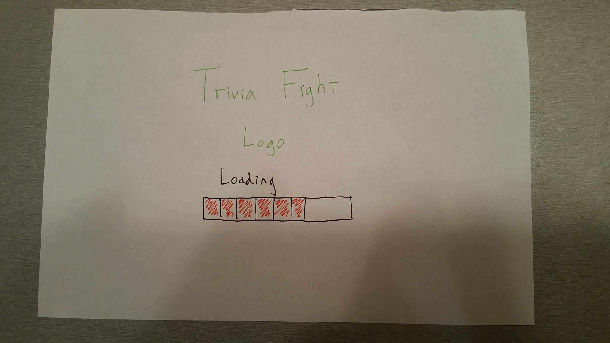
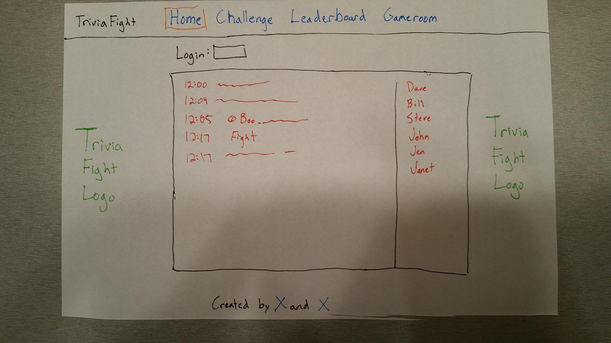

#TriviaFight

Real time trivia/chat app where you can compete against people in a battle of wits.

#Technologies Used:
React.js
<br>
Node.js
<br>
Firebase
<br>
Heroku
<br>
Socket.io: https://www.npmjs.com/package/socket.io
<br>
API- Open Trivia DB: https://opentdb.com/
<br>
EJS

#User Stories
This is where the stories go about why people should want to use this app.

#Wireframe
<<<<<<< HEAD
Loading Page: 

Chat Page: 

Challenge Page: 

Leaderboard: 

Gameboard: 

Component Layout: 
=======
Loading Page: 

Chat Page: 

Challenge Page: 

Leaderboard: 

Gameboard: 

Component Layout: 
>>>>>>> caef5507b76d8314c6dcf8a7b30304f93e5bfa95

###Component Tree
* Item 1
* Item 2
  * Sub Item 1
  * Sub Item 2

###To Run project on your own:
```git clone https://github.com/ZHamburglar/triviafight.git```
<br>
```npm install```
<br>
In your project create a folder on the same level as /images, /public, and /server called "/config"
<br>
In that folder create two files called development.env and test.env
<br>
In those files create variables called:

```
API_KEY=
AUTH_DOMAIN=
DATABASE_URL=
STORAGE_BUCKET=
```

<br>
Go to firebase and create an account.
<br>
Click on "Get Started for Free"
<br>
Click on "Create New Project"
<br>
Click on "Add Firebase to your Web App"
<br>
When the app modal pops up, copy the variables and paste them into the corresponding variables that you created with the development.env and test.env files.
<br>
To run the file in localhost:

```node server.js```
<<<<<<< HEAD

This is a test.
=======
>>>>>>> caef5507b76d8314c6dcf8a7b30304f93e5bfa95
